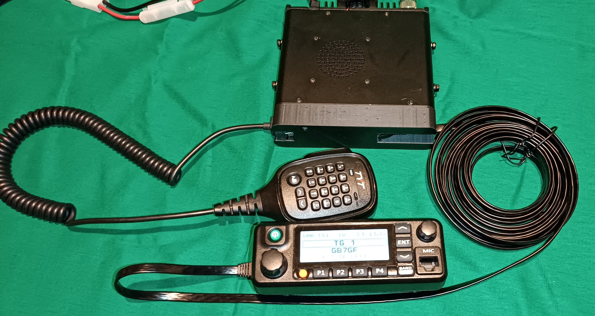

# OpenMD9600_Remote_Head

 

The MD9600 is a good DMR mobile radio but, as standard, it does not have the ability to mount the control head remotely to the main body of the radio. 

The Control Head of the radio is normally connected to the front panel by a 30 conductor Flat Flexible cable. It is impractical to try to extend this cable. 

Now that the radio is able to run the excellent OpenMD9600 firmware it became possible to develop a way of communicating between the radio and the front panel using only a single RJ45 Cat7 cable. This currently requires a modified version of the OpenMD9600 firmware (available from G4EML) but it is hoped that this will be included in a future release of the firmware.  

### <mark>**Note that this modification will only work with the OpenMD9600 firmware. It will not work with the original TYT factory firmware.**</mark>

The mod requres two new small PCBs. 

### Radio Body Interface PCB

This PCB is fitted to the front of the radio body and is connected to the existing 30 way ribbon cable. The necessary signals are routed to a RJ45 socket. A second RJ45 socket is also provided for direct connection of the microphone to the radio body.  Whilst the microphone can still be connected to the remotely mounted head this can suffer from pickup of noise due to the poor screening of the RJ45 cable. It is therefore recommended to connect the microphone directly to the radio body, using an extension cable if necessary. 

The modifed OpenMD9600 firmware detects the presence of the interface board and reconfigures the existing signals into a suitable format. This is a bi-directional 250000 Baud serial link.  Using this link display data is sent to the remote head PCB and front panel key presses are received from it. 

The PCB includes a digital potentiometer chip which is used to control the radio volume.  This chip is controlled by the remote head PCB.  This is necessary to reduce audio noise pickup on the long cable. Also fitted is a power switch chip which is used to control the power to the microphone. 

### Remote Head Interface PCB

This PCB is fitted to the rear of the remote head and connects to the existing 30 way connector.  Serial data to and from the radio body is handled by a Raspberry Pi Pico module which decodes the data and sends it to the Front Panel display, it also reads the front panel buttons and sends their staus to the radio body. 

### Installation

To convert a MD9600 to remote head operation requires the following steps. 

1. Remove front panel from the radio and disconnect the 30 way ribbon cable from the main body. Leave this cable connected to the head.

2. Fit a new 30 way cable between the radio body and the radio body Interface PCB. 

3. Attach the PCB to the front of the radio body using double sided foam tape. 

4. Connect the existing front panel 30 way cable to the remote head interface PCB. 

5. Attach the PCB to the rear of the front panel using double sided foam tape. 

6. Connect the two PCBs togetehr with the RJ45 cable. 

7. Connect the microphone to the second socket on the radio body PCB. 

8. Ensure the MD9600 is running the correct version of OpenMD9600.

9. Power on the radio. It should behave exactly as it did before. 

10. The files are also provided to 3D print covers for the radio body and the head. These are optional but do provide additional protection for the PCBs. 

### How do I make these boards?

All of the information needed to make your own boards is included in this repository. The gerber files for the PCBs are provided and it is now very easy and cheap to get PCBs made in China. Companies such as PCBWAY will accept the Zipped Gerber files as provided and produce 10 PCBs for about £5.  so that is £10 for 10 of both PCBs. I would suggest that you get together with other people in your country and order the boards. 

The components needed to assemble the boards are easily available and a parts list is provided with Farnell, Mouser and Digikey part numbers. 

The only difficult parts to solder are the ribbon cable connectors and the two SOT23-6 chips. However these can both be done with very carefull hand soldering. 

### Programming the Raspberry Pi Pico (Quick Method)

This can be done either before or after the Pico has been soldered to the PCB, it makes no difference.  

1. Locate the file 'NEW.uf2' which will be found in the Pico Firmware directory of this repository and copy it to your desktop. 

2. Hold down the BOOTSEL button on the Pico while connecting it to your PC using its micro USB port. The Pico should appear as a USB disk drive on your PC.

3. Copy the NEW.uf2 file onto the USB drive. The pico will recognise the file and immediately update its firmware and reboot.

 
### Programming the Raspberry Pi Pico using the Arduino IDE (longer method).

The Raspberry Pi Pico is programmed using the Arduino IDE with the Earl F. Philhower, III core. 

#### Installing the Arduino IDE

1. Install the Arduino IDE from here https://downloads.arduino.cc/arduino-1.8.19-windows.exe

2. Open the Arduino IDE and go to File/Preferences.

3. in the dialog enter the following URL in the 'Additional Boards Manager URLs' field: https://github.com/earlephilhower/arduino-pico/releases/download/global/package_rp2040_index.json

4. Hit OK to close the Dialog.

5. Go to Tools->Board->Board Manager in the IDE.

6. Type “pico” in the search box and select “Add”:

#### Downloading the Software.

1. Download the zipped software from https://github.com/g4eml/OpenMD9600_Remote_Head/archive/refs/heads/main.zip

2. Save it to a convenient location and then unzip it. 

#### Programming the Pico

1. Open the Arduino IDE and click File/Open

2. Navigate to the File Arduino/MD9600_Remote_Head/MD9600_Remote_Head.ino (downloaded in the previous step) and click Open.

3. Select Tools/ and make the following settings. 
   
   Board: "Raspberry Pi Pico"
   
   Flash Size: "2Mb (no FS)"
   
   CPU Speed: "133MHz"
   
   Optimise: "Small (-Os)(standard)"
   
   RTTI: "Disabled"
   
   Stack Protection: "Disabled"
   
   C++ Exceptions: "Disabled"
   
   Debug Port: "Disabled"
   
   Debug Level: "None"
   
   USB Stack: "Pico SDK"
   
   IP/Bluetooth Stack: "IPv4 Only"
   
   Upload Method: "Default (UF2)"

4. Connect the Rasperry Pi Pico using the USB port. 

5. Click Sketch/Upload.

The Sketch should compile and upload automatically to the Pico. If the upload fials you may need to disconnect the Pico and then hold down the BOOTSEL button while reconnecting. 

If all has gone well the remote head display should light up and display "MD9600 Remote Head'

Disconnect the USB cable, dconnect the head to the radio body with the RJ45 cable and apply power to the radio.
